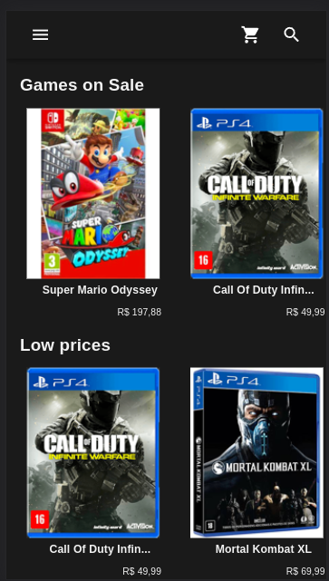
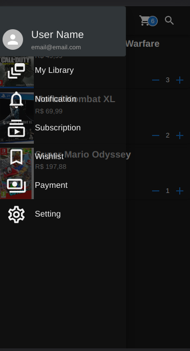
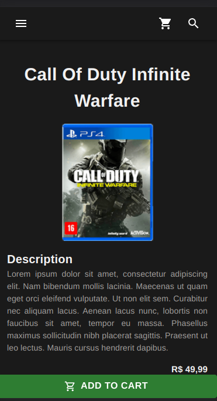
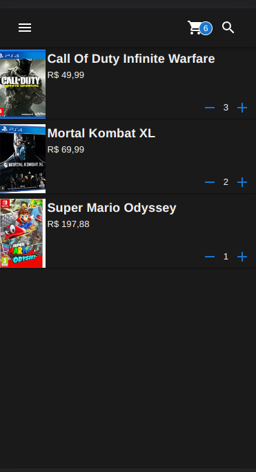

<h1 align="center">
   Supera Job Test
</h1>

<h3 align="center">
    A React app that uses an JSON API to create a game shop
</h3>

<p align="center">
  

  
  
  <a href="https://github.com/ricknois/supera-job-test/commits/master">
    
  </a>

  <a href="https://ricknois.github.io/">
    
  </a>
  
<h4 align="center">
  Status: Finished
</h4>

<p align="center">
 <a href="#about">About</a> •
 <a href="#features">Features</a> •
 <a href="#layout">Layout</a> •
 <a href="#tech-stack">Tech Stack</a> •
 <a href="#author">Author</a> •

</p>

## About

Supera job test it`s a React with Typescript app that uses an API to create a game shop

---

## Features

- [x] The app has three endpoints:
  - [x] "/" Home
  - [x] "/producsts/id" Product detail
  - [x] "/cart" Cart
-

---

## Layout

<p align="center">
  

  
  
  

  
  
</p>

---

### Pre-requisites

Before you begin, you will need to have the following tools installed on your machine:
[Git] (<https://git-scm.com>),
[NPM] (<https://nodejs.org/>),
In addition, it is good to have an editor to work with the code like [VSCode] (<https://code.visualstudio.com/>)

#### Running the app (Web)

```bash

# Clone this repository
$ git clone git@github.com:ricknois/supera-job-test.git

# Install Json Server
$ npm install -g json-server

# Access the project folder in your terminal
$ cd supera-job-test

# Install the dependencies
$ npm i

# Run the api 
$ json-server --watch ./src/services/db/products.json

# Run the application in development mode
$ npm run dev

# Access http://localhost:5173/

```

---

## Tech Stack

The following tools were used in the construction of the project:

**Web**  ([React](https://reactjs.org/)  +  [TypeScript](https://www.typescriptlang.org/))

- **[Material UI](https://mui.com/)**

---

## Author

 <sub><b>Rick Sousa</b></sub>
 <br/>

Made with love by Rick Sousa [Get in Touch!](https://www.linkedin.com/in/ricknois/)

---
